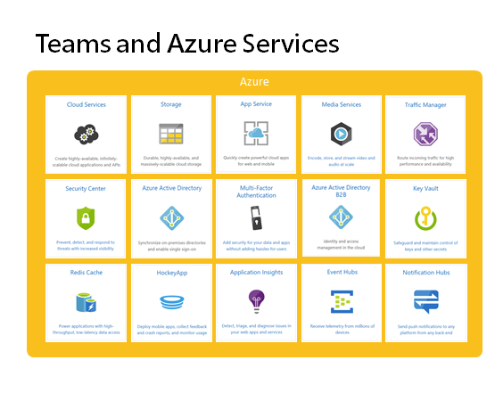

# Microsoft Teams 平台架构

要理解Microsoft Teams 平台以及它给客户或合作伙伴提供的机会，我们仍然要先花一点时间看看这个应用和平台本身是怎么构建起来的。要讲清楚这个，可以另外写一本书，而且很多也涉及到机密。我这里引用在2019年11月份举行的Microsoft Ignite大会上，由 Teams 平台的架构师 Bill bliss所公开分享的内容。请参考下面的链接（英文）：

> 我很高兴跟 Bill 在他位于贝尔维尤的办公室进行过亲切的交流。



Bill 在演讲中提到，“如果没有Azure，我们根本无法交付Microsoft Teams这个产品”。Microsoft Teams在全世界一百多个国家或地区同时提供服务，支持五十几种不同的语言，满足不同地区的安全合规要求，支持跨平台和终端设备。那么到底是什么样的架构才能支撑这种级别的应用服务呢？

## 基于Azure平台进行构建

Microsoft Azure 是经过验证的成熟可靠的智能云平台，尤其在PaaS服务这个层面。Microsoft Teams在架构选型时优先考虑尽可能利用这些基础能力进行构建，使得它天生具备了安全合规，弹性可扩展，高可用性等特点，并且可以在极短的时间内就开发出来，投入市场。

## 重用Microsoft 365 核心服务

在 上一节 我已经提到了，Microsoft Teams的功能，大多都是基于SharePoint，OneDrive，Outlook，Skype for Business \(或Skype）既有的能力实现的，它没有重新开发一套，而是直接将它们整合了起来，从下图可以清晰地看到这一点。

